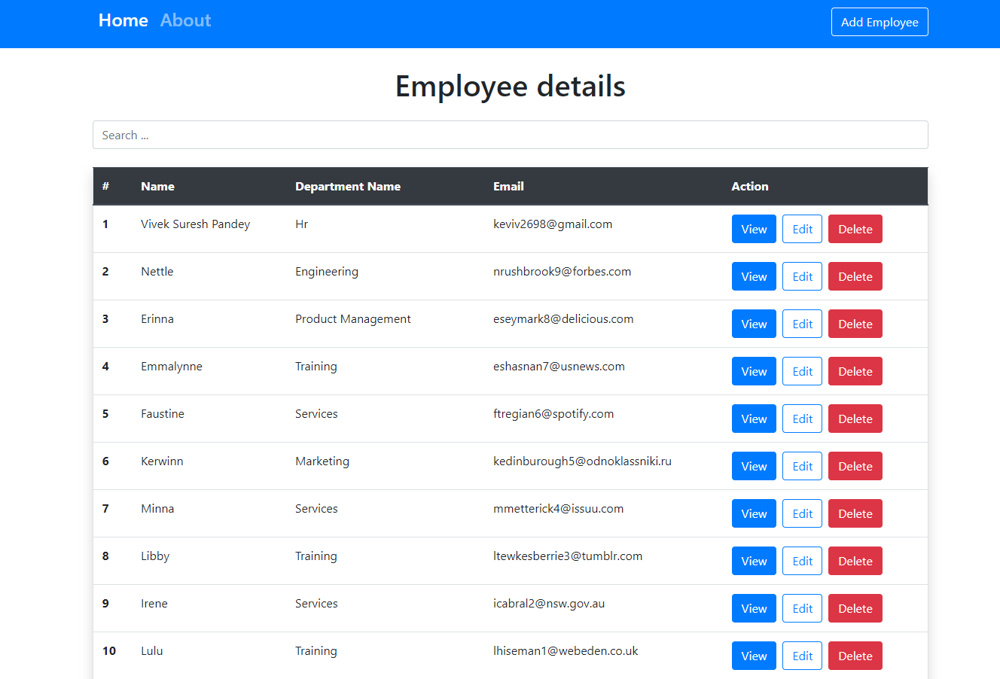

# Employee-Management-System

## Run following command to start the application

## `Run the react app`
        npm start

Runs the app in the development mode. 
Open [http://localhost:3000](http://localhost:3000) to view it in the browser.

The page will reload if you make edits. 
for any error check console.

## `Install json server for database`

        npm i json-server

## `To start json server for database`
        npm run start:dev

## Tech Stack Used
       1. HTML
       2. CSS
       3. JavaScript
       4. Bootstrap
       5. React js
       6. json server
